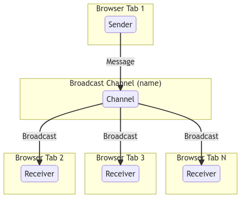
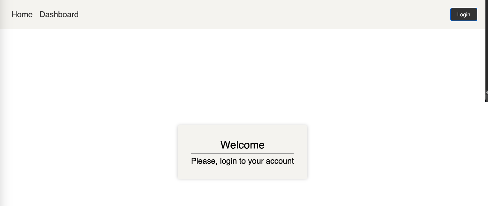
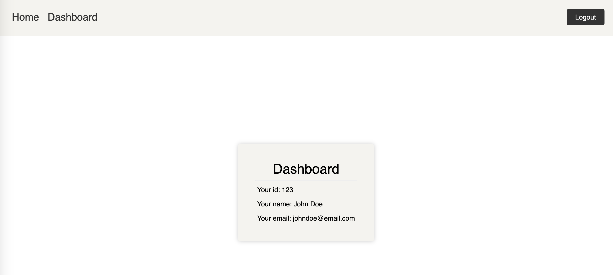

# Tackling Tab Chaos with Broadcast Channel API

Have you ever found yourself drowning in a sea of browser tabs? It’s a common scenario: you click a link, it opens a new tab, and before you know it, you have a plethora to navigate through. This might seem like a minor inconvenience, but what happens when you log into a website and suddenly need to log out from multiple tabs?

Wouldn’t it be convenient to have a way to log out from all tabs at once? Or better yet, imagine updating data on one tab and seeing that update reflected across all open tabs without having to refresh each one manually! This is precisely what we’ll achieve in this post using the [Broadcast Channel API](https://developer.mozilla.org/en-US/docs/Web/API/Broadcast_Channel_API).

## Introduction to Broadcast Channel API

In essence, the Broadcast Channel API enables us to send messages to all browser tabs. It’s a relatively straightforward API supported by all major browsers. Using this API, if you make changes in one tab, you can notify all other tabs to update their data. Similarly, logging out from one tab can inform other tabs to do the same.

### How Does It Work?

The Broadcast Channel API operates by creating a named channel. Any context (tab, window) can join this channel by its name and broadcast messages to all its members.


```js
// Creating a BroadcastChannel object
const channel = new BroadcastChannel('channel_name');

// Broadcasting a message
channel.postMessage('Hello, World!');

// Receiving messages
channel.onmessage = (event) => {
  console.log(event.data); // Outputs: Hello, World!
};
```



## Real-World Example: Next.js, Redux-Toolkit, and TypeScript

Understanding documentation is great, but implementing it in a real project is where the true learning happens. We’ll explore using the Broadcast Channel API in a basic setup commonly found in front-end projects using Next.js, Redux-Toolkit, and TypeScript.

### Getting Started

I’ve prepared a simple boilerplate for this project, which you can clone using the link below:

```bash
https://github.com/tomas-fw/broadcast_channel_post
```

To get the project up and running, open the “project” folder inside your IDE, install the dependencies and start the development server:

```bash
yarn
yarn dev
```

Navigate to `localhost:3000`, and you should see a basic page featuring a counter and a button to increment it.

### Project Structure

Our project consists of a home page and a dashboard page. The home page renders content dynamically based on the user's login status, displaying a welcome message or a prompt to log in.

```tsx
const Home = () => {
    const { user, isLoggedIn } = useSelector((state: RootState) => state.auth);

    return (
        <Layout>
            <main className={styles.wrapper}>
                <section className={styles.card}>
                    <h1 className={styles.title}>Welcome</h1>
                    <hr className={styles.separator} />
                    {isLoggedIn && user ? (
                        <p className={styles.content}>
                            Welcome back, <strong>{user.name}</strong>
                        </p>
                    ) : (
                        <p className={styles.content}>Please, login to your account</p>
                    )}
                </section>
            </main>
        </Layout>
    );
};

export default Home;
```



The dashboard page, accessible only to logged-in users, displays some user-sensitive information.

```tsx
const Dashboard = () => {
    const { user, isLoggedIn, status } = useSelector((state: RootState) => state.auth);
    const router = useRouter();

    useEffect(() => {
        if (router.isReady) {
            if ((!isLoggedIn || !user) && status === 'done') {
                router.push('/');
            }
        }
    }, [isLoggedIn, router, status, user]);

    if (status === 'loading') return <h1>Loading</h1>;
    if (!isLoggedIn || !user) return null;

    return (
        <Layout>
            <main className={styles.wrapper}>
                <section className={styles.card}>
                    <h1 className={styles.title}>Dashboard</h1>
                    <hr className={styles.separator} />

                    <ul className={styles.list}>
                        <li className={styles.list_item}>Your id: {user.id}</li>
                        <li className={styles.list_item}>Your name: {user.name}</li>
                        <li className={styles.list_item}>Your email: {user.email}</li>
                    </ul>
                </section>
            </main>
        </Layout>
    );
};
```



### Navigating with Navbar

Our navbar, shared between the home and dashboard pages, opens each link in a new tab, facilitating our testing of the Broadcast Channel API.


```tsx
const menuItems = [
    {
        name: 'Home',
        path: '/',
    },
    {
        name: 'Dashboard',
        path: '/dashboard',
    },
];

const Navbar = () => {
    const { isLoggedIn } = useSelector((state: RootState) => state.auth);
    const dispatch = useDispatch();

/* ... rest of the code ...*/

    return (
        <nav className={styles.wrapper}>
            <ul className={styles.list}>
                {menuItems.map((item) => (
                    <li key={item.name} className={styles.list_item}>
                        <a href={item.path} target='_blank' rel='noopener noreferrer' className={styles.link}>
                            {item.name}
                        </a>
                    </li>
                ))}
            </ul>
            {isLoggedIn ? (
                <button className={styles.button} onClick={handleLogout}>
                    Logout
                </button>
            ) : (
                <button className={styles.button} onClick={handleLogin}>
                    Login
                </button>
            )}
        </nav>
    );
};

```
### Core Components: AuthInitializer and useBroadcastChannel Hook

Let’s delve into two core components of our project: `AuthInitializer`, a wrapper for our application that manages login status across tabs, and the `useBroadcastChannel` hook, which aids in creating a Broadcast Channel and handling the messages sent to it.

#### AuthInitializer


```tsx
const AuthInitializer: FC<PropsWithChildren> = ({ children }) => {
    const cookies = new Cookies();
    const dispatch = useDispatch();
    const { isLoggedIn, status } = useSelector((state: RootState) => state.auth);
    // Keep track of the previous value of isLoggedIn
    const loggedInRef = useRef(isLoggedIn);

    const { postMessage } = useBroadcastChannel('logoutChannel', (message) => {
        if (message === 'LOGOUT') {
            handleLogout();
        }
    });

    const handleLogin = useCallback(async () => {
        dispatch(setStatus('loading'));
        const res = await loginUser();
        if (!res.success) return;
        loggedInRef.current = true;
        dispatch(
            login({
                email: res.data.email,
                id: res.data.id,
                name: res.data.name,
            })
        );
        dispatch(setStatus('done'));
    }, [dispatch]);

    const handleLogout = useCallback(async () => {
        try {
            dispatch(setStatus('loading'));
            const res = await logoutUser();
            if (!res.success) throw new Error('Logout failed');
            dispatch(logout());
        } catch (error) {
            console.error(error);
        } finally {
            dispatch(setStatus('done'));
        }
    }, [dispatch]);

    useEffect(() => {
        const token = cookies.get('token');
        if (token) handleLogin();
        else dispatch(setStatus('done'));
        // eslint-disable-next-line react-hooks/exhaustive-deps
    }, []);

    useEffect(() => {
        if (loggedInRef.current === true && isLoggedIn === false) {
            postMessage('LOGOUT');
            loggedInRef.current = false;
        } else if (isLoggedIn === true) {
            loggedInRef.current = true;
        }
    }, [isLoggedIn, postMessage]);

    return children;
};
```

#### useBroadcastChannel Hook


```tsx

function useBroadcastChannel(channelName: string, onMessageReceived: (message: any) => void) {
    const channel = useMemo(() => getSingletonChannel(channelName), [channelName]);
    const isSubscribed = useRef(false);

    useEffect(() => {
        if (!isSubscribed.current || process.env.NODE_ENV !== 'development') {
            channel.onmessage = (event) => onMessageReceived(event.data);
        }
        return () => {
            if (isSubscribed.current || process.env.NODE_ENV !== 'development') {
                channel.close();
                isSubscribed.current = true;
            }
        };
        // eslint-disable-next-line react-hooks/exhaustive-deps
    }, []);

    const postMessage = useCallback(
        (message: any) => {
            channel?.postMessage(message);
        },
        [channel]
    );

    return {
        postMessage,
    };
}
```
### Singleton Channel

We maintain a single channel per name, ensuring that a new channel isn’t created every time we call the `useBroadcastChannel` hook.

```tsx
const channelInstances: { [key: string]: BroadcastChannel } = {};

export const getSingletonChannel = (name: string): BroadcastChannel => {
    if (!channelInstances[name]) {
        channelInstances[name] = new BroadcastChannel(name);
    }
    return channelInstances[name];
};
```


### Deep Dive into useBroadcastChannel Hook

The hook receives a channel name and a callback function, executed every time a message is received on the channel.

```tsx
unction useBroadcastChannel(channelName: string, onMessageReceived: (message: any) => void)
```

We utilize this hook in the `AuthInitializer` component to manage logout across tabs.


__Note:__ The `isSubscribedRef` inside the hook prevents the channel from being closed and reopened every time we call the hook, addressing a behavior in React Version 18.

```tsx
 const { postMessage } = useBroadcastChannel('logoutChannel', (message) => {
        if (message === 'LOGOUT') {
            handleLogout();
        }
    });
```


Finally, we create a function allowing us to send messages to the channel.

```tsx
    useEffect(() => {
        if (!isSubscribed.current || process.env.NODE_ENV !== 'development') {
            channel.onmessage = (event) => onMessageReceived(event.data);
        }
        return () => {
            if (isSubscribed.current || process.env.NODE_ENV !== 'development') {
                channel.close();
                isSubscribed.current = true;
            }
        };
        // eslint-disable-next-line react-hooks/exhaustive-deps
    }, []);
```

## Wrapping Up

The Broadcast Channel API offers a seamless way to communicate between tabs, making user experiences like simultaneous logout and data updates across tabs a breeze. Integrating it into a real-world project, as we did with Next.js, Redux-Toolkit, and TypeScript, demonstrates its practicality and ease of use. 

By employing the strategies discussed and leveraging the provided boilerplate, you’re well on your way to mastering tab communication and enhancing your web applications!